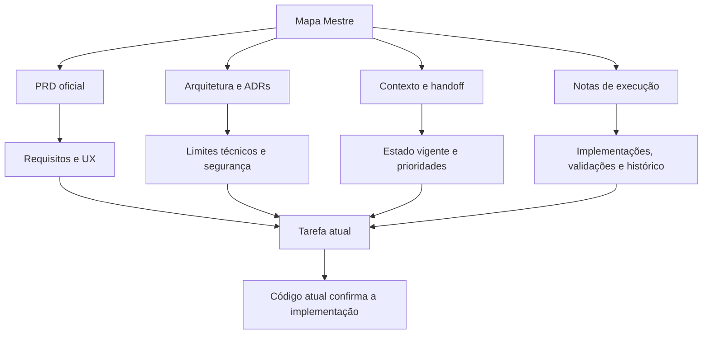

> Latência, tooltip e diferença entre Zabbix/Ping manual: [[03-Execucao/Tooltip e origem da latencia]].

> Telemetria SNMP FortiGate: [[03-Execucao/Correcao Telemetria SNMP FortiGate]].

# Mapa Mestre do Vault — HealthLink Sentinel

Este é o mapa completo da memória documental do projeto. Ele conecta todas as notas do vault, define a ordem de leitura e evita que registros históricos sejam confundidos com o estado atual.

> [!important] Como interpretar o vault
> 1. O **PRD oficial** e as **ADRs aceitas** prevalecem sobre notas derivadas.
> 2. O **código atual** confirma o que está efetivamente implementado.
> 3. As notas de contexto e execução registram continuidade, validações e pendências.
> 4. Notas históricas não devem ser tratadas isoladamente como estado vigente.

## Leitura obrigatória para qualquer nova sessão

1. [[00-Handoff Novo Chat]]
2. [[00-Contexto Atual]]
3. [[00-Índice e Contexto Atual]]
4. [[00-Mapa Mestre do Vault]]
5. [[03-Execucao/Estado Atual]]
6. [[01-Produto/Fonte PRD/README — Índice da fonte oficial]]
7. A ADR aplicável em [[04-Decisoes/ADR-001 Multi-tenancy desde o MVP]]
8. As notas do módulo específico envolvido na tarefa

## Entrada e contexto consolidado

- [[HealthLink Sentinel]] — página inicial do vault.
- [[00-Handoff Novo Chat]] — continuidade mais recente entre sessões.
- [[00-Contexto Atual]] — resumo rápido de produto, arquitetura e prioridades.
- [[00-Índice e Contexto Atual]] — índice canônico do estado consolidado.
- [[02-Arquitetura/Briefing Visual - Como funciona o HealthLink Sentinel]] — explicação ilustrada do sistema e das integrações.
- [[2026-08-05]] — nota diária histórica vazia; mantida para preservar a estrutura do vault.

## Fonte oficial do produto

Comece pelo índice da fonte. Os documentos abaixo são requisitos oficiais e não devem ser simplificados por notas de execução.

- [[01-Produto/Fonte PRD/README — Índice da fonte oficial]]
- [[01-Produto/Fonte PRD/PRD-README]]
- [[01-Produto/Fonte PRD/01-VISAO-PRODUTO]]
- [[01-Produto/Fonte PRD/02-ARQUITETURA-SISTEMA]]
- [[01-Produto/Fonte PRD/03-DESIGN-SYSTEM]]
- [[01-Produto/Fonte PRD/04-UX-FLUXOS]]
- [[01-Produto/Fonte PRD/BANCO-DADOS]]
- [[01-Produto/Fonte PRD/MAPA-INTERATIVO]]
- [[01-Produto/Fonte PRD/MODULOS]]
- [[01-Produto/Fonte PRD/USUARIOS-RBAC]]
- [[01-Produto/Fonte PRD/ZABBIX-API]]
- [[01-Produto/Fonte PRD/ROADMAP]]

## Produto — notas derivadas

- [[01-Produto/Visão do Produto]]
- [[01-Produto/Requisitos Oficiais]]

## Arquitetura e decisões

- [[02-Arquitetura/Arquitetura de Referência]]
- [[02-Arquitetura/Modelo de Dados]]
- [[02-Arquitetura/Briefing Visual - Como funciona o HealthLink Sentinel]]
- [[04-Decisoes/ADR-001 Multi-tenancy desde o MVP]]

## Estado, planejamento e infraestrutura

- [[03-Execucao/Estado Atual]] — fotografia canônica da execução.
- [[03-Execucao/Próximos Passos]] — fila histórica de próximos trabalhos; validar contra o handoff.
- [[03-Execucao/Plano de Implementacao]] — fases e sequência de implementação.
- [[03-Execucao/Contexto Consolidado]] — consolidação histórica; usar o índice atual como prevalente.
- [[03-Execucao/Provisionamento Inicial]]
- [[03-Execucao/PostgreSQL Local]]
- [[03-Execucao/Dados de Demonstração]]
- [[03-Execucao/Equipamentos de Demonstração]]
- [[03-Execucao/Limpeza das Unidades Ficticias]]

## Autenticação, usuários, RBAC e segurança

- [[03-Execucao/Autenticação Implementada]]
- [[03-Execucao/Painel de gerenciamento de usuarios]]
- [[03-Execucao/Formulario Usuarios e Popups Host Status]]
- [[03-Execucao/Solicitacao e aprovacao de acesso]]
- [[03-Execucao/Redefinição Segura de Senha]]

## Unidades, equipamentos e inventário

- [[03-Execucao/CRUD de Unidades]]
- [[03-Execucao/CRUD de Equipamentos]]
- [[03-Execucao/Frontend - Detalhe Operacional da Unidade]]
- [[03-Execucao/Unidade Zabbix Server]]
- [[03-Execucao/Geolocalizacao automatica Zabbix]]

## Monitoramento, alertas e operação

- [[03-Execucao/API Operacional de Alertas]]
- [[03-Execucao/Ciclo de Vida de Alertas]]
- [[03-Execucao/Frontend - Central de Alertas]]
- [[03-Execucao/Central de Alertas - Ativos e Historico]]
- [[03-Execucao/Estado Operacional e Zabbix]]
- [[03-Execucao/Operacao de Monitoramento - Fase 3]]
- [[03-Execucao/Status sem telemetria - regra visual]]
- [[03-Execucao/Diagnosticos Ping e Tracert]]
- [[03-Execucao/Diagnostico flutuante e menu na lista]]
- [[03-Execucao/Notificacoes NOC e Design Revision]]
- [[03-Execucao/Plano de Coleta Starlink e Unidade Movel]]
- [[03-Execucao/Agente - Atualizacao Automatica e Versao 1.0]]

## Centro Operacional, mapas e experiência visual

- [[03-Execucao/Frontend Corporativo - Fundação]]
- [[03-Execucao/Centro Operacional - Mapa Interativo]]
- [[03-Execucao/Centro Operacional - Mapa Geografico Dark]]
- [[03-Execucao/Centro Operacional - Fase 4]]
- [[03-Execucao/Menu contextual do mapa - diagnosticos]]
- [[03-Execucao/Otimizacao de carregamento do mapa]]
- [[03-Execucao/Revisao visual glassmorphism]]
- [[03-Execucao/Header Profile Dropdown e Theme Switch]] — registro histórico; o handoff atual informa remoção do seletor visual de tema.

## Integração Zabbix — implementação e evolução

### Base e conectividade

- [[03-Execucao/Adapter Zabbix Implementado]]
- [[03-Execucao/Aguardando Hosts Zabbix]]
- [[03-Execucao/Correção da Integração Zabbix]]
- [[03-Execucao/Correcao tela Integracao Zabbix]]
- [[03-Execucao/Validação Integração Zabbix]]

### Catálogo, sugestões e vínculos

- [[03-Execucao/Frontend - Cadastro e Vinculo Zabbix]]
- [[03-Execucao/Mapeamento Zabbix Equipamentos]]
- [[03-Execucao/Mapeamento Zabbix Validado]]
- [[03-Execucao/Sugestao de vinculo - correspondencia por nome]]
- [[03-Execucao/Sugestao de vinculo clicavel]]
- [[03-Execucao/Status e ponte de hosts Zabbix]]

### Sincronização e validação operacional

- [[03-Execucao/Sincronizacao Zabbix Preview]]
- [[03-Execucao/Sync Preview Validado]]
- [[03-Execucao/Sincronizacao Zabbix Persistente]]
- [[03-Execucao/Worker Zabbix Automático]]
- [[03-Execucao/Validação do Fluxo Zabbix]]

## Correções recentes de inventário

- [[03-Execucao/Correcao Cadastro de Equipamentos - Campos Opcionais]]

## Templates do vault

- [[Templates/Nota de Decisão]]
- [[Templates/Registro de Sessão]]

## Conteúdo sensível e Inbox

- [[00-Inbox/CREDENCIAL LOCAL — SYSADMIN]] — **nota restrita e legada**. Não abrir automaticamente, não usar como contexto, não reproduzir e não copiar valores para código, documentação, logs ou commits. Credenciais devem permanecer apenas em configuração local segura.

## Mapa de dependências do conhecimento

## Regras de manutenção

1. Toda nova nota deve receber ao menos um link neste mapa ou em um índice de módulo ligado a ele.
2. Mudanças relevantes devem atualizar o handoff, o estado consolidado aplicável e a nota do módulo.
3. Uma nota histórica deve ser marcada como histórica quando divergir do estado vigente.
4. Links quebrados e notas órfãs devem ser verificados após reorganizações.
5. Segredos nunca devem ser registrados ou reproduzidos no vault.
6. Antes de implementar, confrontar PRD, ADR, notas do módulo e código atual.
