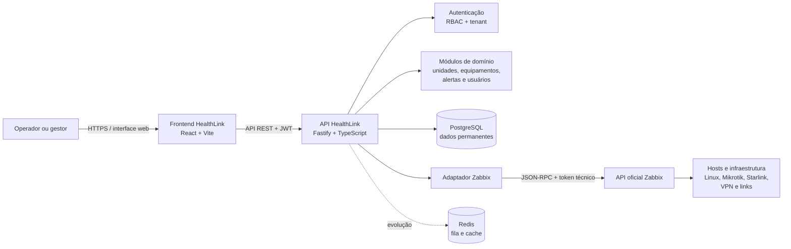
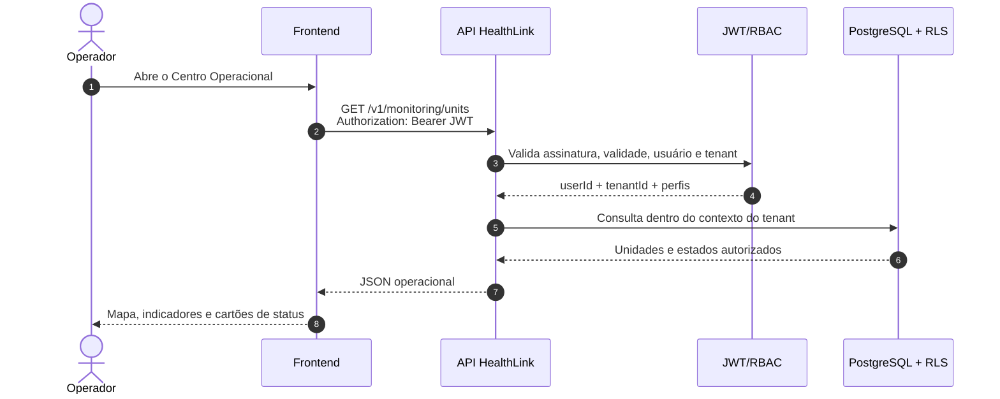
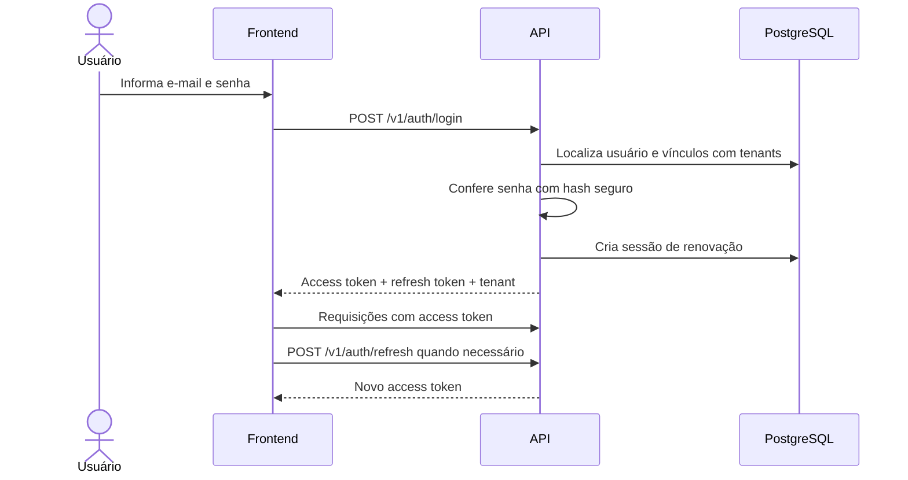
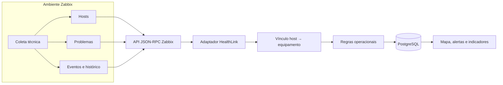
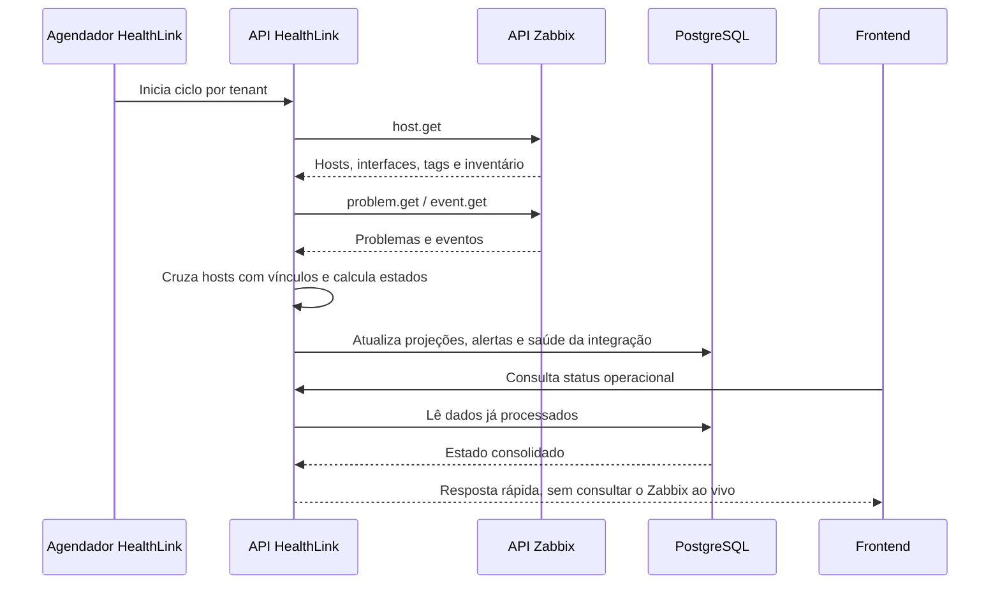
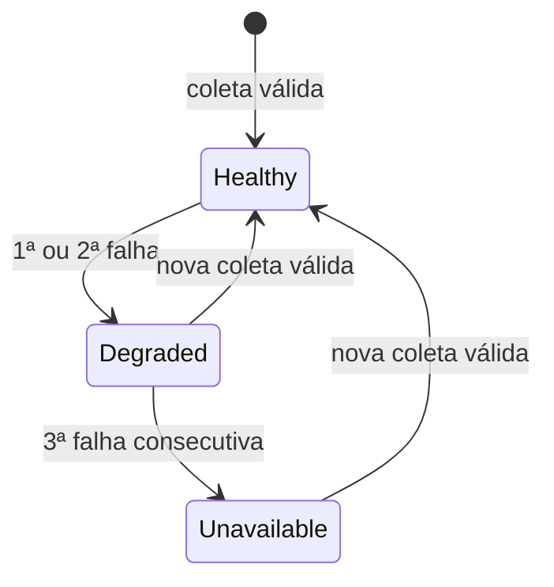
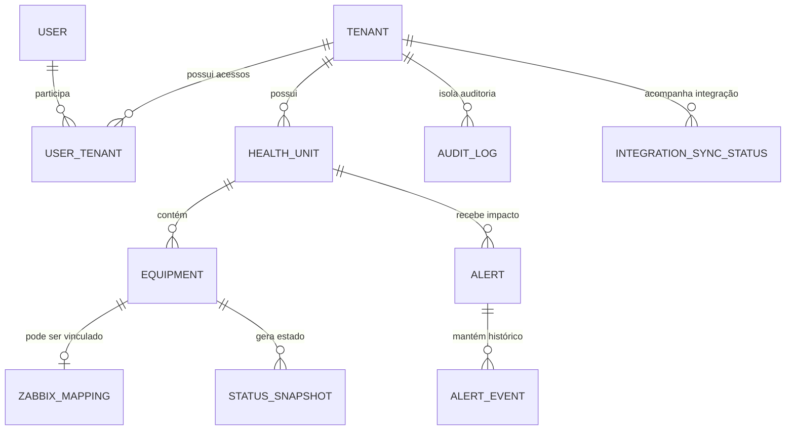
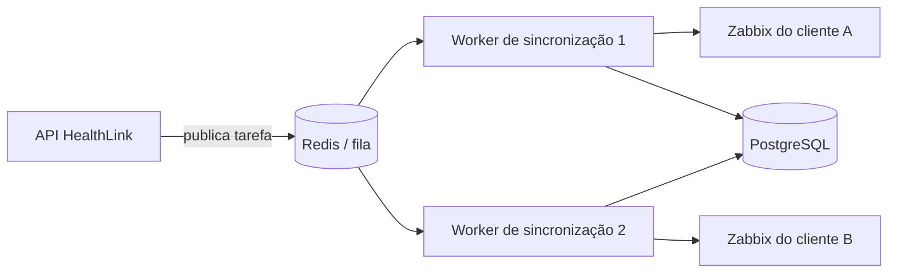
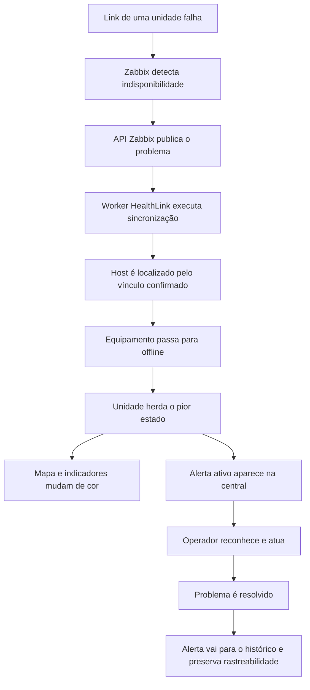

> [!info] Versão em PDF
> Exportação diagramada disponível em `output/pdf/HealthLink Sentinel - Briefing Visual do Sistema.pdf`.

# HealthLink Sentinel — briefing visual do sistema

## 1. Resumo executivo

O **HealthLink Sentinel** é uma plataforma SaaS corporativa para acompanhar a infraestrutura tecnológica de unidades móveis de saúde. Seu papel é transformar sinais técnicos — disponibilidade de servidores, roteadores, VPNs, links e equipamentos — em uma visão operacional simples para quem administra a operação.

O sistema não substitui o Zabbix. Os dois produtos têm responsabilidades diferentes:

- **Zabbix:** coleta e entrega os dados técnicos dos ativos.
- **HealthLink Sentinel:** organiza esses dados por cliente, unidade e equipamento; interpreta o impacto; apresenta alertas, mapa, histórico e ações operacionais.

> [!summary] Em uma frase
> O Zabbix enxerga hosts e problemas técnicos; o HealthLink transforma isso em “qual unidade de saúde está em risco, por quê e o que o operador precisa observar”.

## 2. Visão geral desenhada



### Regra de segurança central

O frontend **nunca acessa o Zabbix diretamente**. Toda comunicação passa pela API HealthLink, onde são aplicados autenticação, tenant, permissões, regras de negócio e auditoria.

## 3. Componentes e responsabilidades

| Componente | Responsabilidade | Tecnologia/estado atual |
|---|---|---|
| Frontend | Apresentar centro operacional, mapa, unidades, equipamentos, alertas, conexões, integração e usuários | React + Vite, implementado |
| API HealthLink | Validar requisições, autenticar, autorizar e executar regras de negócio | Fastify + TypeScript, implementado |
| PostgreSQL | Guardar usuários, tenants, inventário, vínculos, estados, alertas, sessões e auditoria | Banco permanente, implementado |
| Adaptador Zabbix | Isolar a comunicação JSON-RPC e traduzir respostas técnicas | Implementado |
| Worker Zabbix | Executar sincronizações automáticas por tenant | Interno à API, implementado |
| Redis | Apoiar filas, cache, travas e retentativas em escala | Previsto; não é obrigatório no funcionamento atual |
| Zabbix | Coletar dados dos ativos e disponibilizar hosts, problemas, eventos e históricos | Sistema externo integrado |

## 4. Como uma chamada de API funciona

### Exemplo: operador abre o Centro Operacional



Cada requisição protegida segue esta sequência:

1. O frontend envia o token JWT no cabeçalho `Authorization`.
2. A API verifica a assinatura e a validade do token.
3. O token informa `userId`, `tenantId` e perfis do usuário.
4. O RBAC verifica se o perfil permite a ação.
5. A consulta ao banco é executada no contexto do tenant.
6. O PostgreSQL reforça o isolamento com Row-Level Security (RLS).
7. A API devolve apenas os dados autorizados.

## 5. Login, sessão e isolamento entre clientes



- O **access token** dura 15 minutos e acompanha as chamadas protegidas.
- O **refresh token** permite renovar o acesso sem solicitar a senha novamente.
- Um usuário pode estar associado a mais de um tenant, mas a sessão opera em um tenant por vez.
- A ADR-001 exige `tenant_id`, contexto por requisição e RLS desde o MVP.
- Excluir um usuário de um cliente remove sua associação com aquele tenant; o histórico global é preservado.

## 6. Integração Zabbix — o coração da telemetria

### 6.1 O que trafega entre os sistemas



O endereço configurado atualmente é uma URL privada da API JSON-RPC do Zabbix. Para funcionar, a máquina da API HealthLink precisa estar na mesma rede ou conectada à VPN/rota que alcance esse servidor.

As credenciais ficam no ambiente seguro da API. Elas não devem aparecer no frontend, no código, no Obsidian ou em commits.

### 6.2 Ponte entre host e operação

O Zabbix conhece um **host**. O HealthLink precisa saber a qual equipamento e unidade esse host pertence:

```text
Host Zabbix
   ↓ vínculo confirmado pelo operador
Equipamento HealthLink
   ↓ pertence a
Unidade móvel
   ↓ aparece em
Centro Operacional, mapa e alertas
```

O sistema pode sugerir correspondências usando nome, tags e interfaces, mas não cria o vínculo automaticamente. A confirmação humana evita associar telemetria à unidade errada.

### 6.3 Ciclo de sincronização



O worker interno:

- inicia a primeira sincronização alguns segundos após a API;
- repete o ciclo a cada 60 segundos por padrão;
- descobre os tenants ativos;
- executa a sincronização no contexto de cada tenant;
- registra sucesso, duração, quantidades e falhas.

### 6.4 Como o estado operacional é calculado

| Situação recebida/observada | Estado no HealthLink |
|---|---|
| Host habilitado, acessível e sem problema ativo | `online` |
| Problema ativo não crítico | `degraded` |
| Interface principal indisponível | `offline` |
| Problema de severidade 4 ou 5 | `offline` |
| Host ausente, desabilitado ou sem coleta confiável | `unknown` |

A unidade herda o pior estado entre seus equipamentos ativos. Assim, um problema técnico relevante fica visível no mapa sem exigir que o operador interprete dezenas de telas do Zabbix.

### 6.5 Proteção contra “verde falso”



- Uma ou duas falhas consecutivas deixam a integração em atenção.
- A terceira falha torna a integração indisponível.
- Os equipamentos vinculados passam para `unknown` quando a coleta deixa de ser confiável.
- Uma coleta válida restaura a saúde e zera o contador.

Essa regra impede que dados antigos continuem verdes como se fossem atuais.

## 7. Principais áreas funcionais

### Centro Operacional

- visão geral da operação;
- indicadores de unidades online, degradadas, offline e sem telemetria;
- mapa interativo do Brasil;
- filtros operacionais;
- ranking de problemas, histórico resolvido e cobertura de monitoramento;
- acesso ao detalhe da unidade.

### Unidades móveis e equipamentos

- cadastro e edição de unidades, UF, cidade e coordenadas;
- cadastro, edição, desativação e exclusão de equipamentos;
- inventário operacional sem duplicar o mesmo equipamento;
- diagnósticos Ping e Tracert exibidos em painel flutuante;
- vínculo do equipamento com um host Zabbix.

### Alertas

- separação entre alertas ativos e histórico resolvido;
- reconhecimento e resolução controlados;
- severidade e contexto da unidade/equipamento;
- rastreabilidade do ciclo de vida.

### Status das conexões e Integração Zabbix

- saúde do conector;
- última tentativa e última coleta válida;
- duração, falhas consecutivas e último erro;
- hosts encontrados, hosts vinculados e problemas recebidos;
- catálogo de hosts e gestão da ponte host → equipamento;
- sincronização manual além do ciclo automático.

### Usuários e acesso

- criação e edição de usuários;
- bloqueio e desbloqueio;
- remoção do vínculo com o tenant;
- solicitação externa sujeita a aprovação;
- perfis: Administrador Global, Administrador Cliente, Supervisor, Operador NOC e Visualizador.

### Relatórios e auditoria

- Auditoria faz parte da arquitetura e das ações sensíveis já implementadas.
- Relatórios constam no PRD e nas permissões, mas a tela funcional ainda é uma evolução pendente.

## 8. Mapa resumido das APIs atuais

| Grupo | Endpoints principais | Finalidade |
|---|---|---|
| Saúde | `GET /health` | Confirmar que a API está ativa |
| Autenticação | `/v1/auth/login`, `/refresh`, `/logout`, `/me` | Criar, renovar, encerrar e consultar sessão |
| Unidades | `GET/POST /v1/units`, `GET/PATCH/DELETE /v1/units/:id` | Administrar unidades móveis |
| Equipamentos | `/v1/units/:unitId/equipment`, `/v1/equipment/:id` | Administrar inventário e diagnósticos |
| Monitoramento | `/v1/monitoring/units`, `/equipment`, `/alerts`, `/events` | Consultar projeções e operar alertas |
| Zabbix | `/test`, `/status`, `/sync-preview`, `/sync`, `/mapping-candidates`, `/mappings` | Testar, sincronizar e administrar vínculos |
| Usuários | `/v1/users`, `/v1/access-requests` | Gestão de usuários e aprovações |

> [!important] Observação
> A tabela é um mapa de entendimento, não um contrato completo de parâmetros. O código atual das rotas é a fonte da verdade da API implementada.

## 9. Onde os dados ficam



O PostgreSQL é a memória permanente. O mapa e o dashboard leem projeções já processadas no banco, em vez de depender de uma chamada ao Zabbix para cada abertura de tela.

## 10. Onde o Redis entraria

O Redis não substitui o PostgreSQL e não é necessário para o ambiente atual. Em uma operação maior, ele poderá assumir trabalhos temporários:



Usos previstos: fila de sincronizações, retentativas, cache, controle de concorrência, rate limiting e distribuição de eventos em tempo real. Hoje, a sincronização roda dentro da própria API.

## 11. Exemplo completo de um incidente



## 12. Situação atual e fronteiras

### Implementado e documentado

- autenticação JWT, sessão e contexto de tenant;
- RBAC e isolamento multi-tenant;
- CRUD de unidades e equipamentos;
- estados operacionais e alertas;
- centro operacional e mapas;
- integração, vínculos e sincronização Zabbix;
- gestão de usuários e solicitações de acesso;
- saúde da integração e proteção contra telemetria obsoleta.

### Previsto ou ainda pendente de consolidação

- relatórios completos conforme o PRD;
- tela dedicada de consulta de auditoria;
- uso efetivo do Redis e workers separados;
- retenção definitiva de métricas e eventos;
- topologia produtiva: Zabbix exclusivo por cliente ou compartilhado;
- confirmação dos padrões oficiais de nomes, grupos e tags dos hosts;
- funções avançadas previstas no PRD, como criação de hosts e associação de templates, antes de uso operacional amplo.

## 13. Checklist rápido de disponibilidade

| Verificação | O que confirma |
|---|---|
| `http://localhost:3000/health` responde | API HealthLink ativa |
| `http://localhost:5173` abre | Frontend ativo |
| PostgreSQL aceita conexão na porta 5432 | Persistência disponível |
| API alcança o endereço privado do Zabbix | Rota local/VPN operacional |
| `/v1/integrations/zabbix/status` está saudável | Coleta válida e recente |
| Última coleta e contadores avançam | Worker sincronizando corretamente |

## 14. Referências do projeto

- [[../00-Contexto Atual]]
- [[Arquitetura de Referência]]
- [[Modelo de Dados]]
- [[../03-Execucao/Operacao de Monitoramento - Fase 3]]
- [[../03-Execucao/Frontend - Cadastro e Vinculo Zabbix]]
- [[../03-Execucao/Worker Zabbix Automático]]
- [[../04-Decisoes/ADR-001 Multi-tenancy desde o MVP]]
- [[../01-Produto/Fonte PRD/README — Índice da fonte oficial]]
